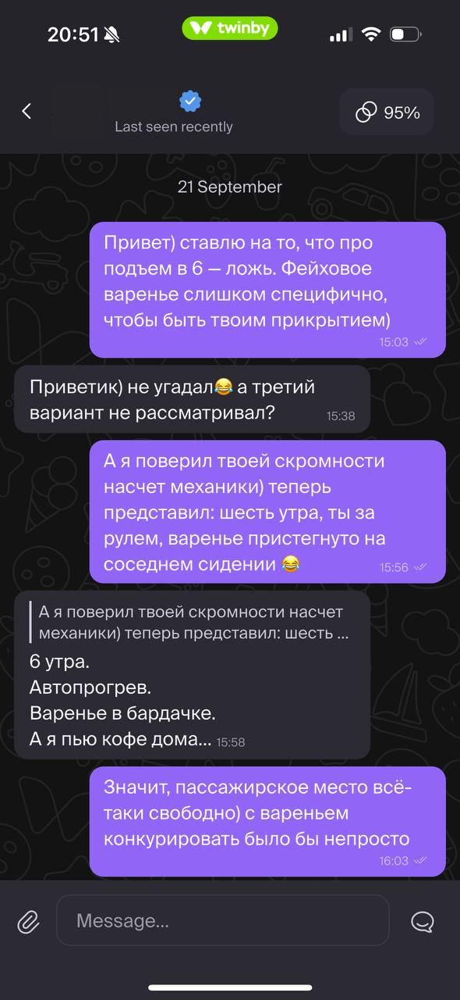
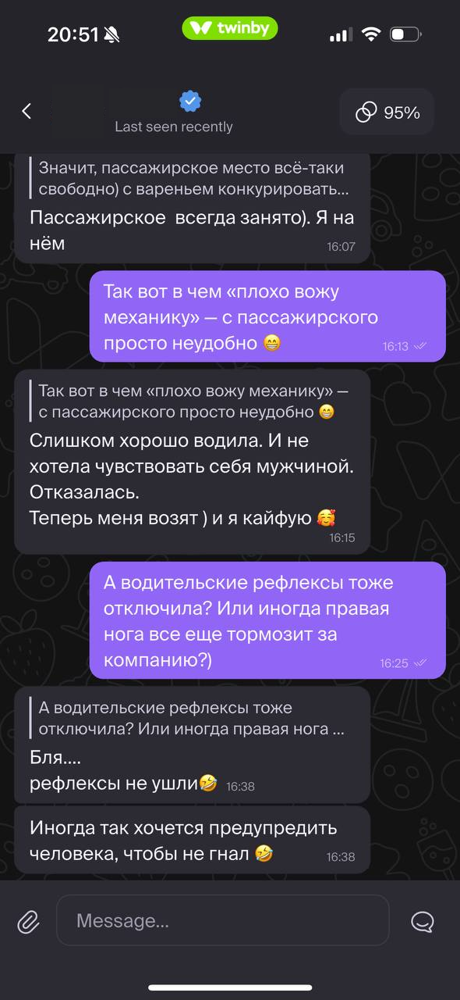
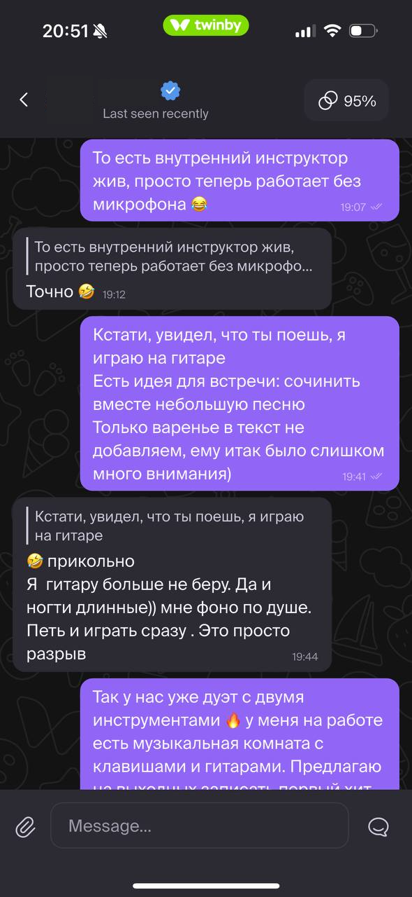
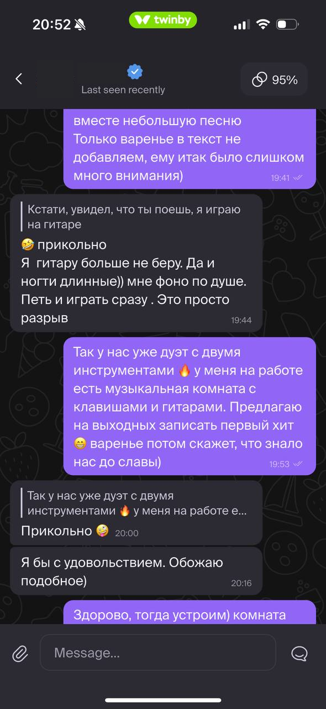

# Реальный пример: от знакомства до согласия на встречу

Переписка в приложении знакомств с использованием версии 0.5. Пользователь выбирал предложения помощника, иногда уточнял контекст и запрашивал новые варианты. Сообщения отправлял самостоятельно.

Разговор начался с игры «две правды и одна ложь» в анкете, перешёл в общую шутку, а затем — в предложение встретиться и вместе заняться музыкой.

**Результат:** собеседница ответила на приглашение: «Я бы с удовольствием. Обожаю подобное)». Это согласие на идею встречи; скриншоты не подтверждают согласование точного времени или состоявшуюся встречу.

Этот пример показывает совместный результат работы помощника и пользователя; по одному диалогу нельзя оценить вероятность успеха.

Имя и аватарка закрыты непрозрачными прямоугольниками. Текст сообщений оставлен без изменений, включая разговорную лексику.

## 1. Начало по детали анкеты

## 2. Совместная игра и личные подробности

## 3. Переход к общему интересу

## 4. Согласие на идею встречи

Скриншоты идут по порядку, соседние изображения частично перекрываются. Начало следующего сообщения на последнем скриншоте обрезано самим снимком.

[Вернуться к инструкции по запуску](README.md)
